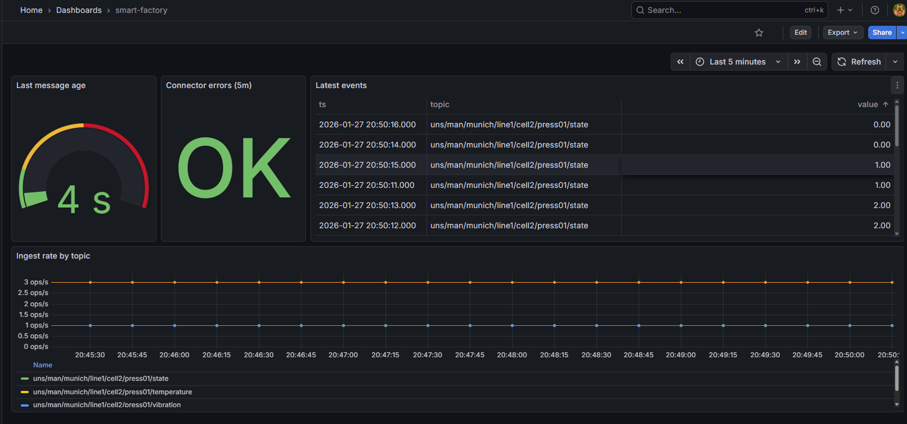

## Factory Edge Lab — UNS → MQTT → Connector → Historian → Observability

A small, reproducible **factory edge platform** demo that mirrors real IT/OT data integration patterns:

- **Unified Namespace (UNS)** topic model over MQTT
- **Connector** service that consumes events and writes to a **TimescaleDB (Postgres) historian**
- **Observability** with **Prometheus + Grafana** (ingest rate, errors, staleness/last-message age)
- **Operating concept** for deployment, monitoring, incident handling, and rollout

This lab is designed to be “portable edge”: run it locally, on a jumpbox, or adapt it for Kubernetes/edge clusters.

---

## Architecture

**Flow:** Simulator → Mosquitto (MQTT) → Connector → TimescaleDB → Grafana  
Prometheus scrapes connector metrics.



---

## Unified Namespace (UNS)

Topic format:

- `uns/man/<site>/<line>/<cell>/<asset>/<signal>`


Example topics:
- `uns/man/munich/line1/cell2/press01/temperature`
- `uns/man/munich/line1/cell2/press01/vibration`
- `uns/man/munich/line1/cell2/press01/state`

Payload (JSON):

```json
{
  "ts": "2026-01-27T20:27:14Z",
  "value": 25.0,
  "quality": "good"
}
```
## Repo structure
```text
factory_edge_lab/
  connector/             # MQTT → historian + Prometheus metrics
  simulator/             # Publishes UNS telemetry
  mosquitto/             # MQTT broker config
  db/                    # Timescale init schema
  grafana/               # (optional) provisioning
  docs/
    operating-concept.md
    architecture.png
  docker-compose.yml
  prometheus.yml
```
## Quickstart
1) Start the stack
```shell
docker compose up -d --build
```
2) Verify services

- `Grafana: http://localhost:3000`
- `Prometheus: http://localhost:9090`
- `Connector metrics: http://localhost:8000/metrics`

3) Verify MQTT messages
```shell
docker exec -it factory_edge_lab-mqtt-1 sh -lc "mosquitto_sub -t 'uns/#' -v -C 5"
```
4) Verify historian writes
```shell
docker exec -it factory_edge_lab-db-1 psql -U postgres -d historian \
  -c "select topic, count(*) from measurements group by topic order by 2 desc;"
```

## Grafana dashboard (4 operator panels)

- These panels demonstrate the operational view of a factory edge pipeline:

1) Ingest rate by topic
```shell
sum by (topic) (rate(mqtt_messages_total[1m]))
```

2) Connector errors (5m)
```shell
increase(connector_errors_total[5m])
```
3) Last message age (seconds)
```shell
time() - connector_last_message_unix
```
4) Latest events (Timescale table)
```shell
SELECT ts, topic, value
FROM measurements
WHERE ts > now() - interval '5 minutes'
ORDER BY ts DESC
LIMIT 20;
```
> ### What this demo proves (for factory edge)
>  - This lab demonstrates a practical event-driven data pipeline at the edge: a consistent namespace for structured telemetry (UNS), containerized connectors, a historian for durable querying, and an operations-first observability layer (throughput, errors, and staleness detection). It is designed as a repeatable blueprint that can scale from a single pilot line to multi-site rollouts with standardization, monitoring, and incident handling.
> ### Operating concept
>  - See: docs/operating-concept.md